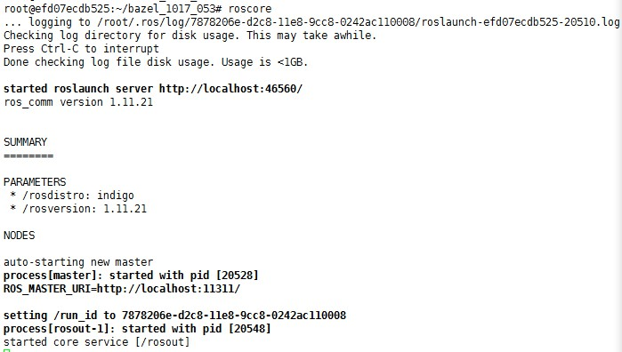

本文针对apollo-platform的源码编译进行描述和问题排除。

源码下载：
```
 wget https://github.com/ApolloAuto/apollo-platform/archive/2.1.2.tar.gz
```
（1） 安装依赖库
首先安装libgtest-dev、python-empy,  python-nose, libtheora-dev, libogg-dev, libgstreamer-plugins-base0.10-dev, libgstreamer0.10-dev（支持audio框架）。
安装依赖包的命令如下：
```
# apt-get install libgstreamer0.10-dev
# apt-get install libgstreamer-plugins-base0.10-dev
# apt-get install ligogg-dev
# apt-get install libtheora-dev
# apt-get install python-empy python-nose
```
（2） PCL编译安装
ros依赖PCL，需要重新编译PCL的aarch64版本。编译方法如下：
```
a)	安装依赖的库文件，比如gtest，boost，eigen， flann，HDF5，VTK等。
b)	下载PCL源码：https://github.com/PointCloudLibrary/pcl
c)	解压源码，并进入解压后的目录，然后执行如下命令：
  # mkdir build
  # cd build
  # cmake ../
如果编译release版本：
  # cmake -DCMAKE_BUILD_TYPE=Release ../
  # make & make install
  ```
（3） 修改编译脚本
在如下目录的CMakefiles.txt文件中添加include path (vision_opencv/cv_bridge/include)。
image_transport_plugin/compressed_depth_image_transport
image_transport_pligin/image_transport_plugin
（4） Apollo专用Ros的编译安装
运行如下命令
```
  # cd apollo-platform/ros
  # ./build.sh build
 ```

编译可能遇到的问题：

## if
	(Make sure that you have installed "catkin_pkg")
		sudo apt-get install python-catkin-pkg
## if
	(CMake Error at CMakeLists.txt:11 (find_package)By not providing "Findconsole_bridge.cmake" in CMAKE_MODULE_PATH this  project has asked CMake to find a package configuration file provided by "console_bridge", but CMake did not find one.
	Could not find a package configuration file provided by "console_bridge")
	{
		mkdir cb_ws
		cd cb_ws
		wget https://github.com/ros/console_bridge/archive/0.4.0.tar.gz
		tar xvf 0.4.0.tar.gz
		cd console_bridge-0.4.0/
		cmake ./
		make
		make install
	}
## if
	(CMake Error at /usr/share/cmake-2.8/Modules/FindBoost.cmake:1131 (message):
	Unable to find the requested Boost libraries.)
	{
		wget http://sourceforge.net/projects/boost/files/boost/1.53.0/boost_1_53_0.tar.bz2
		tar xvf boost_1_53_0.tar.bz2
		cd boost_1_53_0/
		sudo ./bootstrap.sh
		sudo ./b2
		sudo ./b2 install
	}
## if
	(Project 'class_loader' tried to find library 'PocoFoundation'.)
	{
		wget https://github.com/pocoproject/poco/archive/poco-1.9.0-release.tar.gz
		tar xvf poco-1.9.0-release.tar.gz
		./configure
		make
		make install
## if
	(fatal error: openssl/opensslv.h: No such file or directory)
		{
			wget https://www.openssl.org/source/openssl-1.0.2h.tar.gz
			tar xvf openssl-1.0.2h.tar.gz
			./Configure
			./config shared zlib
			make depend
			make install
			mv /usr/bin/openssl /usr/bin/openssl.bak
			mv /usr/include/openssl /usr/include/openssl.bak
			ln -s /usr/local/ssl/bin/openssl /usr/bin/openssl
			ln -s /usr/local/ssl/include/openssl /usr/include/openssl
			ln -s /usr/local/ssl/lib/libcrypto.so /usr/local/lib/libcrypto.so
			ln -s /usr/local/ssl/lib/libssl.so /usr/local/lib/libssl.so
			echo "/usr/local/ssl/lib" >> /etc/ld.so.conf
			ldconfig -v
			检测安装是否成功：openssl version -a
		}
	}
## if
	(-fpermissive)
	{
		apt-get install libvtk5-qt4-dev
		apt-get install -y liblog4cxx10-dev
		在所有logdebug,logwarn等等报错函数前面加 CONSOLE_BRIDGE_
		ps:(https://talk.apolloauto.io/t/topic/77)
	}
	if(Cannot specify link libraries for target "image_geometry-utest" which is)
	{
		sudo apt install libgtest-dev
	}
## if
	(CMake Error at /usr/local/share/pcl-1.7/PCLConfig.cmake:41 (message):
	common is required but boost was not found)
	{
		apt-get install libboost-all-dev
		ln -s /usr/lib/aarch64-linux-gnu/libstdc++.so.6.0.21 /usr/lib/aarch64-linux-gnu/libstdc++.so.6
	}
## if
	(package 'ogg' not found)
	{
		sudo apt-get install libogg-dev
	}
## if
	(package 'theora' not found)
	{
		sudo apt-get install libtheora-dev liblua5.1-0-dev liblua50-dev liblualib50-dev liblivemedia-dev libogg-dev libmad0-dev libfaad-dev liba52-dev libflac-dev
		sudo apt-get install libmpeg2-4-dev
	}

编译完成后需要将apollo-platform/ros/install/ros_aarch64拷贝到/home/tmp/目录下，并重命名为ros
至此，安装完毕，使用roscore命令检查安装是否成功
安装成功现象：


测试时相关故障排除：
	 
## if
	(root@efd07ecdb525:~/apollo-master# roscore 
	Traceback (most recent call last):
	File "/opt/ros/bin/roscore", line 36, in <module>
	from rosmaster.master_api import NUM_WORKERS)
	{
		cd third_party
		./build.sh build
		cd ../
		./build.sh build
		cd third_party/swig_wrappe
		bash build.sh
	}
## if
	(while loading shared libraries: libxxxxx.so.xxx)
	{
		find this.so
		export LD_LIBRARY_PATH=xxx
		or try do like this:
		ln -s /usr/lib/aarch64-linux-gnu/libboost_system.so.1.54.0 /usr/lib/aarch64-linux-gnu/libboost_system.so.1.58.0
### if
	(symbol lookup error: /opt/ros/lib/librosconsole_log4cxx.so)
		{
			# mv /opt/ros/lib/librosconsole_log4cxx.so /opt/ros/lib/xxx_librosconsole_log4cxx.so
			# cp ~/apollo-master/PCL/librosconsole_log4cxx.so /opt/ros/lib/
		}
	}
